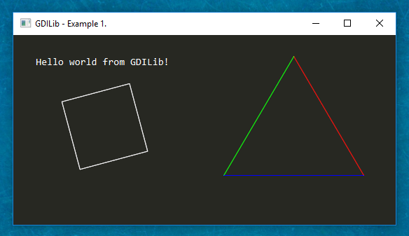

# node-gdi
Node.js bindings to Windows GDI (graphics device interface)

Alpha version, development in progress...

Install
=======
```
npm i gdi
```

Example
=======

[](examples/simple.js)

```javascript
const GDILib = require('gdi');

// create window
const window = GDILib.init({ title: 'GDILib - Example 1.' });

let angle = 0;

window.onPaint(p => {
  // clear screen to gray
  // p.clear(r, g, b)
  p.clear(39, 40, 34); 


  // draw text
  p
    // p.brushColor(r, g, b, a = 255)
    .brushColor(255, 255, 255)
    // p.font(name, size, weight)
    .font('Consolas', 16, 400)
    // p.text(x, y, str)
    .text(30, 30, 'Hello world from GDILib!');


  // draw colored triangle
  p
    // p.penColor(r, g, b, a = 255)
    .penColor(255, 0, 0) 
    // p.line(startX, startY, endX, endY)
    .line(400, 30, 500, 200)
    .penColor(0, 255, 0)
    .line(400, 30, 300, 200)
    .penColor(0, 0, 255) 
    .line(300, 200, 500, 200);


  // draw rotating rectangle
  p
    // p.rotate(angle, originX, originY)
    .rotate(angle, 50 + 80, 50 + 80)
    .penColor(255, 255, 255)

    // p.rectangle (x, y, width, height)
    .rectangle(80, 80, 100, 100); 

});

setInterval(() => {
  angle += 1;
  window.repaint();
}, 25);
```

GDILib methods
=======

GDILib.init(options)
-----


Window methods
=======

window.close()
-----


window.getPosition()
-----


window.getSize()
-----


window.hide()
-----


window.maximize()
-----


window.messageBox(text, title = 'Message')
-----


window.minimize()
-----


window.onClick(cb)
-----


window.onClose(cb)
-----


window.onCreate(cb)
-----


window.onKeyDown(cb)
-----


window.onKeyPress(cb)
-----


window.onKeyUp(cb)
-----


window.onMouseDown(cb)
-----


window.onMouseMove(cb)
-----


window.onMouseUp(cb)
-----


window.onPaint(cb)
-----


window.onResize(cb)
-----


window.repaint()
-----


window.restore()
-----


window.setCursor(type)
-----


window.setPosition(x, y)
-----


window.setSize(width, height)
-----


window.setTitle(title)
-----


window.show()
-----


Graphics methods
=======

p.arc(x, y, width, height, startAngle, sweepAngle)
-----


p.bezier(points)
-----


p.brushColor(r, g, b, a = 255)
-----


p.brushLinearGradient(x1, y1, x2, y2, r1, g1, b1, r2, g2, b2, a1 = 255, a2 = 255)
-----


p.brushRadialGradient(x, y, width, height, r1, g1, b1, r2, g2, b2, a1 = 255, a2 = 255)
-----


p.clear(r, g, b, a = 255)
-----


p.curve(points, close = false, fill = false)
-----


p.ellipse(x, y, width, height, stroke = true, fill = false)
-----


p.flush()
-----


p.font(name, size = 14, weight = 400, italic = false, underline = false, strikeout = false)
-----


p.image(x, y, buf, width = -1, height = -1, srcX = 0, srcY = 0, srcWidth = -1, srcHeight = -1)
-----


p.line(x1, y1, x2, y2)
-----


p.measure(text, width, height)
-----


p.penColor(r, g, b, a = 255)
-----


p.penWidth(width)
-----


p.pie(x, y, width, height, startAngle, sweepAngle, stroke = true, fill = false)
-----


p.polygon(points, stroke = true, fill = false)
-----


p.rectangle(x, y, width, height, stroke = true, fill = false)
-----


p.resetClip()
-----


p.resetTransform()
-----


p.rotate(angle, originX = 0, originY = 0)
-----


p.setAlignment(alignment)
-----


p.setClip(x, y, width, height, combineMode = 'REPLACE')
-----


p.setFormatFlags(flags)
-----


p.setTrimming(trimming)
-----


p.text(x, y, text, width, height)
-----


